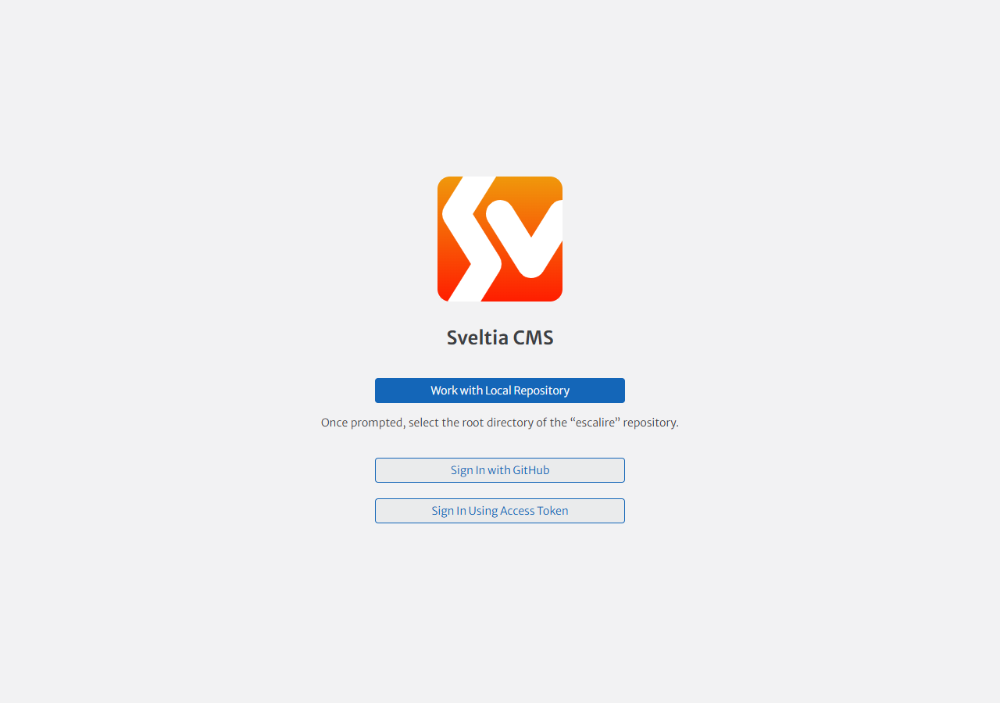

# Guide de l'espace d'administration — Librairie Escalire

Ce guide s'adresse à l'équipe de la librairie. Aucune connaissance technique
n'est nécessaire. L'admin fonctionne sur ordinateur et tablette (Chrome,
Firefox, Safari ou Edge récents).

## L'essentiel en 30 secondes

1. Ouvrir **https://vferries.github.io/escalire/admin/**
2. Cliquer sur **« Se connecter avec GitHub »** et entrer son compte GitHub.
3. Choisir un contenu (Coups de cœur, Rencontres…), modifier, **Enregistrer**.
4. Le site se met à jour tout seul en **2 à 5 minutes**.

## Se connecter

- L'accès se fait avec votre **compte GitHub personnel** (créé avec Vincent,
  voir le tableau des accès dans `ADMIN-SETUP.md`).
- Première connexion : GitHub demande d'autoriser « Escalire admin » — cliquer
  sur **Authorize**.
- Mot de passe oublié : « Forgot password? » sur github.com, ou voir Vincent.
- L'interface s'affiche en français si votre navigateur est en français ;
  sinon : icône ⚙ (Réglages) → *Language* → Français.

## Ajouter un coup de cœur

1. Menu **Coups de cœur** → bouton **Créer**.
2. **ISBN** : les 13 chiffres au dos du livre, sous le code-barres, sans
   espaces ni tirets. La couverture est récupérée automatiquement à partir
   de ce numéro.
3. **Citation** : votre mot de libraire, 1 à 2 phrases (200 caractères max).
4. **Titre, auteur, éditeur** : à remplir (le remplissage automatique depuis
   l'ISBN arrivera dans une prochaine étape).
5. **Visible** : coché = affiché sur le site. Le site montre au maximum
   **6 coups de cœur**, du plus petit « ordre » au plus grand.
6. **Enregistrer**.

<!-- TODO capture (Task 4 fallback) -->

Si la couverture ne s'affiche pas sur le site après quelques minutes :
vérifier l'ISBN ; en dernier recours, ajouter une photo dans « Couverture
(secours) ».

## Annoncer une rencontre

1. Menu **Rencontres & événements** → **Créer**.
2. Remplir titre, **date et heure**, type, description ; ajouter l'affiche
   (image) et un lien externe si besoin (billetterie, publication Instagram).
3. Cocher **Visible sur le site** puis **Enregistrer**.
4. Le site met en avant le **prochain événement à venir** ; les événements
   passés sont archivés automatiquement chaque nuit — rien à faire.

## Horaires, annonce exceptionnelle, coordonnées

- Menu **Horaires & infos pratiques**.
- Horaires : un créneau s'écrit exactement `10h00 – 12h30` (espace, tiret
  demi-cadratin « – », espace). Laisser vide = fermé. Le formulaire refuse
  tout autre format — copier un créneau existant au besoin.
- **Annonce exceptionnelle** : ex. « Fermé le 15 août » — s'affiche en bandeau
  sur le site tant que le champ n'est pas vide. Penser à le vider ensuite.
- Ne pas toucher au bloc **Adresse** (il pilote la carte).

## Équipe et textes

- **Équipe** : prénom, portrait (photo carrée de préférence, affichée en
  rond), rayon favori, ordre d'affichage.
- **Textes du site** : slogan du haut de page et paragraphes « La librairie »
  — à modifier rarement.

## Enregistrer, et après ?

<!-- TODO capture (Task 4 fallback) -->

- **Enregistrer** publie la modification : elle part sur GitHub et le site se
  reconstruit automatiquement (2 à 5 minutes).
- Si une valeur est refusée (message rouge), c'est le garde-fou du site :
  corriger le champ indiqué — **une modification admin ne peut pas casser le
  site**.
- En cas de doute ou de panne : contacter Vincent. Le site public reste
  toujours en ligne, même si l'admin est indisponible.
